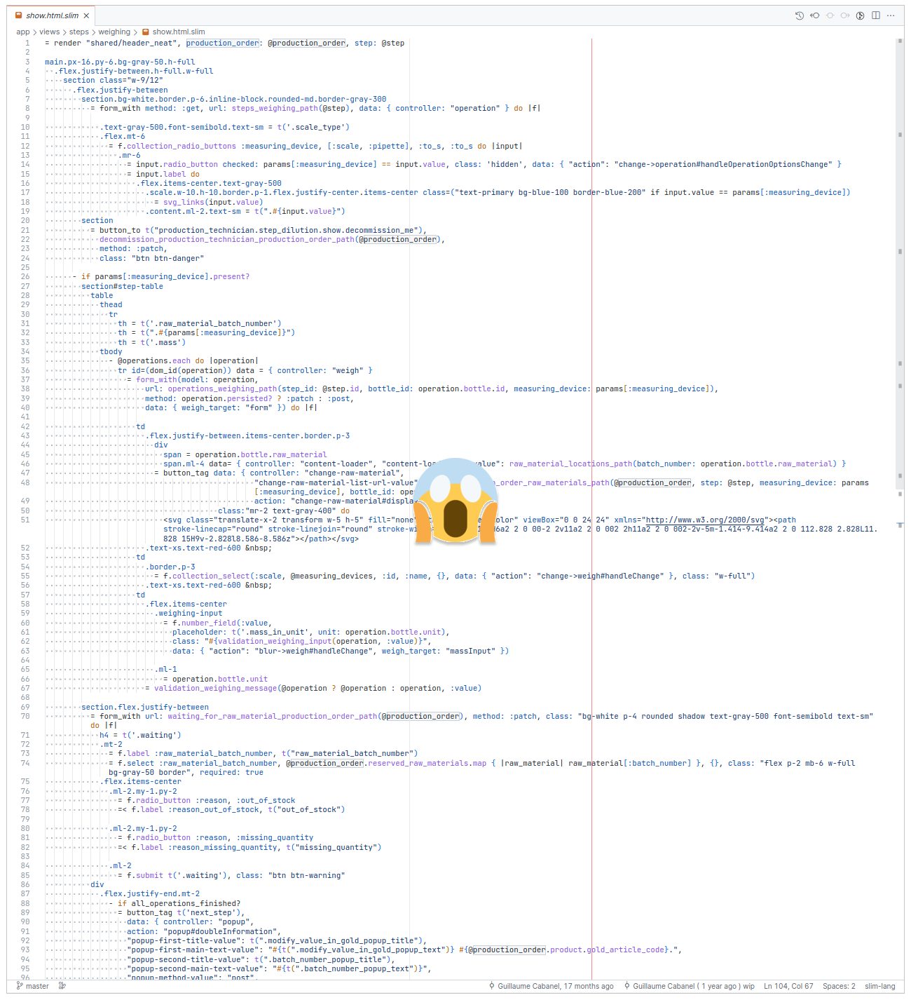
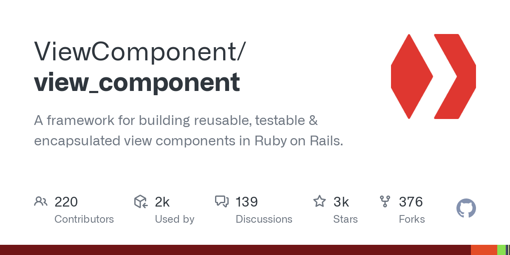

# Comment gérer la complexité des vues en Rails avec ViewComponent ?


Une application Web est vite amenée à présenter des vues complexes.

Des éléments asyncrones peuvent être ajoutés à la page.

Des éléments peuvent être ajoutés ou supprimés dynamiquement.

Il faut respecter la cohérence de l'UI.



Cela peut amener à des vues complexes et difficiles à maintenir.

Même avec l'utilisation de partials et helpers,
on a de la logique dans les vues.

## ViewComponent

[ViewComponent](https://viewcomponent.org/)

- inspiré par les avantages de React

- développé puis _open sourcé_ par GitHub

- prototype présenté à la RailsConf 2019

L'objectif principal est de simplifier la manière dont les développeurs
construisent des vues complexes pour les applications Rails.


## Fonctionnement
Un _ViewComponent_ est objet Ruby et un _template_.

```ruby
# app/components/message_component.rb
class MessageComponent < ViewComponent::Base
  def initialize(name:)
    @name = name
  end
end
```

```erb
<%# app/components/message_component.html.erb %>
<h1>Hello, <%= @name %>!</h1>
```

Une _instance_ qui est passé au `#render` de Rails.

```erb
<%# app/views/demo/index.html.erb %>
<%= render(MessageComponent.new(name: "World")) %>
```

Qui génère le HTML suivant :

```html
<h1>Hello, World!</h1>
```

## Pourquoi ViewComponent ?
### Single Responsibility Principle
_Principe de responsabilité unique_

Garder la logique dans la vue déroge au SRP et tend à rendre le code complexe.

### Don't Repeat Yourself
_Ne vous répétez pas_

En utilisant des composants réutilisables, on facilite la cohérence de l'UI.

### Testabilité & Performance
### TL;DR

- Pour remplacer les _partials_ qui sont **réutilisées** ou que l'on veut
**tester** facilement.

- Pour remplacer les **templates** qui comporte **beaucoup de Ruby** en
ViewComponents.

## Bonnes pratiques
Opinion construit sur la base de l'expérience des équipes de GitHub, des articles
que j'ai pu lire et de l'expérience chez Kuartz.

### Deux types de composants
#### Génériques
Composants commun pour l'UI

```erb
<%= render(ButtonComponent.new) { "Default" } %>
<%= render(ButtonComponent.new(scheme: :primary)) { "Primary" } %>
<%= render(ButtonComponent.new(scheme: :danger)) { "Danger" } %>
<%= render(ButtonComponent.new(scheme: :invisible)) { "Invisible" } %>
```


#### Spécifiques à l'application
Pour transformer un objet métier (souvent un modèle _ActiveRecord_)
en un ensemble de composants génériques.

```erb
<%= render(User::ContributorComponent.new(user: @user)) %>
```


### Organisation

> "Good frameworks are extracted, not invented." DHH

1. Composant spécifique à un cas d'utilisation implémenté dans l'application.

1. Composant adapté pour une utilisation générale dans plusieurs endroits de l'application.

1. Composant extrait dans une Gem et documenté dans
[Lookbook](https://github.com/ViewComponent/lookbook).

### 💡 Tips

- La plupart des méthodes d'instance peuvent être privées

- Préférer les ViewComponents aux _partials_

- Préférer les ViewComponents aux _helpers_ générant du

- Éviter le _Global state_

- Éviter les requêtes à la base de données

- Passer un objet plutôt que 3+ attributs d'objet

```ruby
class MyComponent < ViewComponent::Base
  # bad
  def initialize(repository_name:, repository_owner:, repository_created_at:)
    #...
  end

  # good
  def initialize(repository:)
    #...
  end
end
