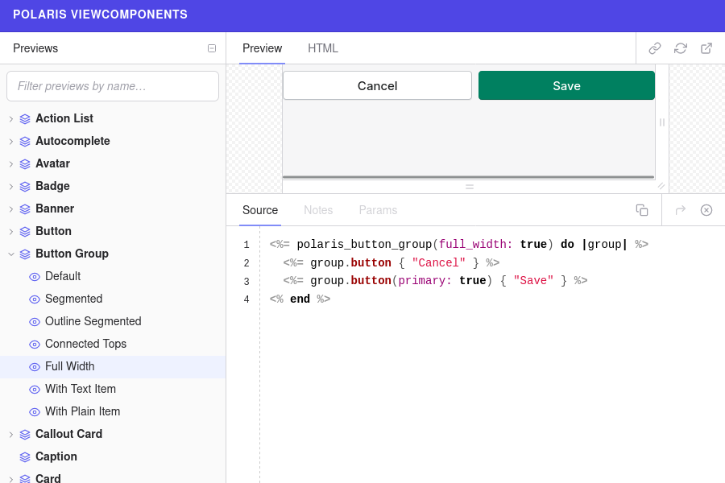

 <!-- .element: class="shadow-img" width="896" height="512" -->

Note:
Une application Web est vite amenée à présenter des vues complexes.

Des éléments asyncrones peuvent être ajoutés à la page.

Des éléments peuvent être ajoutés ou supprimés dynamiquement.

Il faut respecter la cohérence de l'UI.


 <!-- .element: class="shadow-img" width="589" height="647" -->

Note:
Cela peut amener à des vues complexes et difficiles à maintenir.

Même avec l'utilisation de partials et helpers,
on a de la logique dans les vues.


 <!-- .element: class="shadow-img" width="600" height="300" -->

- inspiré par les avantages de React

- développé puis _open sourcé_ par GitHub

- prototype présenté à la RailsConf 2019

Note:
L'objectif principal est de simplifier la manière dont les développeurs
construisent des vues complexes pour les applications Rails.


# Fonctionnement


Un _ViewComponent_ est

un objet Ruby

```ruby
# app/components/message_component.rb
class MessageComponent < ViewComponent::Base
  def initialize(name:)
    @name = name
  end
end
```

et un _template_
<!-- .element: class="fragment" data-fragment-index="1" -->

```erb
<%# app/components/message_component.html.erb %>
<h1>Hello, <%= @name %>!</h1>
```
<!-- .element: class="fragment" data-fragment-index="1" -->


Une _instance_ qui est passée au `#render` de Rails.

```erb
<%# app/views/demo/index.html.erb %>
<%= render(MessageComponent.new(name: "World")) %>
```

Qui génère le HTML suivant : <!-- .element: class="fragment" data-fragment-index="1" -->

```html
<h1>Hello, World!</h1>
```
<!-- .element: class="fragment" data-fragment-index="1" -->


# Pourquoi ViewComponent ?


##### Single Responsibility Principle
_Principe de responsabilité unique_

Garder la logique dans la vue déroge au SRP et tend à rendre le code complexe.

Note:
Le système des vues en Rails ne respecte pas ce principe

Contrairement à d'autres frameworks Ruby comme Hanami


##### Don't Repeat Yourself
_Ne vous répétez pas_

En utilisant des composants réutilisables, on facilite la cohérence de l'UI et
la maintenance


##### Performance & Testabilité

~10x plus rapide que les _partials_ dans des cas d'utilisation réels

Note:
Précompilation de tous les templates ViewComponent au démarrage de l'application

(exécution pour les vues Rails traditionnelles)


##### Testabilité

Un test unitaire pour chaque composant facile à mettre en place.


#### TL;DR

<ul style="list-style-type: none">
  <li class="fragment">
    ✅ Pour remplacer les <em>partials</em> qui sont
    <strong>réutilisées</strong> ou que l'on veut
    <strong>tester</strong> facilement.
  </li>
  <li class="fragment">
    ✅ Pour remplacer les <em>templates</em> qui comportent
    <strong>beaucoup de Ruby</strong> en ViewComponents.
  </li>
</ul>


# Bonnes pratiques

Note:
Opinion construit sur la base de l'expérience des équipes de GitHub, des articles
que j'ai pu lire et de l'expérience chez Kuartz.


#### Deux types de composants (1/2)

**Génériques**

```erb [1|2|3|4]
<%= render(ButtonComponent.new) { "Default" } %>
<%= render(ButtonComponent.new(scheme: :primary)) { "Primary" } %>
<%= render(ButtonComponent.new(scheme: :danger)) { "Danger" } %>
<%= render(ButtonComponent.new(scheme: :invisible)) { "Invisible" } %>
```

<!-- .element: class="shadow-img" -->

Note:
Composants commun pour l'UI


#### Deux types de composants (2/2)
**_App-specific_**

```erb
<%= render(User::ContributorComponent.new(user: @user)) %>
```

<!-- .element: class="shadow-img" -->

Note:
Pour transformer un objet métier (souvent un modèle _ActiveRecord_)
en un ensemble de composants génériques.


#### Organisation

> "Good frameworks are extracted, not invented." DHH

Spécifique 👉 Générique

Note:
1. Composant spécifique à un cas d'utilisation implémenté dans l'application.
1. Composant adapté pour une utilisation générale dans plusieurs endroits de l'application.
1. Composant extrait dans une lib et documenté dans [Lookbook](https://github.com/ViewComponent/lookbook).


#### 💡 Tips

<ul style="list-style-type: none">
  <li class="fragment">✅ La plupart des méthodes d'instance peuvent être privées</li>
  <li class="fragment">✅ Préférer les ViewComponents aux <em>partials</em></li>
  <li class="fragment">✅ Préférer les ViewComponents aux <em>helpers</em> générant du HTML</li>
  <li class="fragment">✅ Éviter le <em>Global state</em></li>
  <li class="fragment">✅ Éviter les requêtes à la base de données</li>
</ul>


✅ Passer un objet plutôt que 3+ attributs d'objet

```ruby[1-11|2-3|7-8]
class MyComponent < ViewComponent::Base
  # bad
  def initialize(repository_name:, repository_owner:, repository_created_at:)
    #...
  end

  # good
  def initialize(repository:)
    #...
  end
end
```


<!-- .element: height="50" -->

Librairie et aperçu des ViewComponents de l'application.

Polaris (Github Design System)

<!-- .element: height="300" class="shadow-img" -->


# Merci

<!-- .element: height="300" width="600" class="shadow-img" -->

[kuartz-org/view_component_conf](https://github.com/kuartz-org/view_component_conf)
