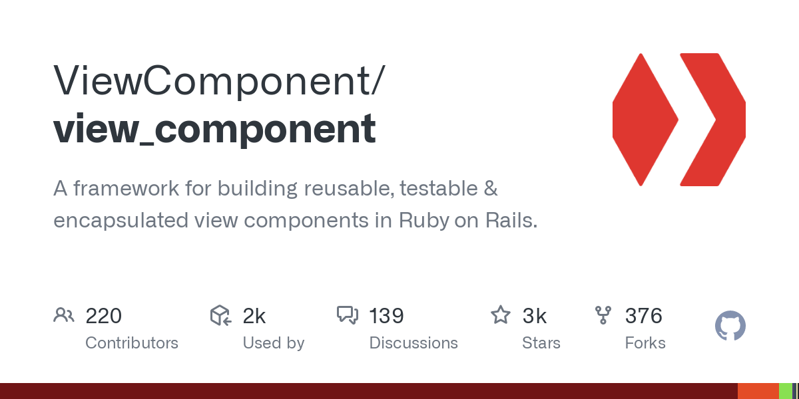

Note:
Une application Web est vite amenée à présenter des vues complexes.

Des éléments asyncrones peuvent être ajoutés à la page.

Des éléments peuvent être ajoutés ou supprimés dynamiquement.

Il faut respecter la cohérence de l'UI.


Note:
Cela peut amener à des vues complexes et difficiles à maintenir.

Même avec l'utilisation de partials et helpers,
non a de la logique dans les vues.




- inspiré par les avantages de React

- développé puis _open sourcé_ par GitHub

- prototype présenté à la RailsConf 2019

Note:
L'objectif principal est de simplifier la manière dont les développeurs
construisent des vues complexes pour les applications Rails.


## Fonctionnement

Un _ViewComponent_ est objet Ruby et un _template_.

```ruby
# app/components/message_component.rb
class MessageComponent < ViewComponent::Base
  def initialize(name:)
    @name = name
  end
end
```

```erb
<%# app/components/message_component.html.erb %>
<h1>Hello, <%= @name %>!</h1>
```


Une _instance_ qui est passé au `#render` de Rails.

```erb
<%# app/views/demo/index.html.erb %>
<%= render(MessageComponent.new(name: "World")) %>
```

Qui génère le HTML suivant :

```html
<h1>Hello, World!</h1>
```


# Pourquoi ViewComponent ?


##### Single Responsibility Principle
_Principe de responsabilité unique_

Garder la logique dans la vue déroge au SRP et tend à rendre le code complexe.


##### Don't Repeat Yourself
_Ne vous répétez pas_

En utilisant des composants réutilisables, on facilite la cohérence de l'UI.


##### Testabilité & Performance


#### TL;DR

- Fonctionne le mieux avec les _partials_ qui sont **réutilisées** ou que l'on
veut **tester** directement.

- Transformez les _templates_ qui comporte **beaucoup de Ruby**
en ViewComponents.


# Bonnes pratiques


#### Deux types de composants (1/2)

**Génériques**

```erb [1|2|3|4]
<%= render(ButtonComponent.new) { "Default" } %>
<%= render(ButtonComponent.new(scheme: :primary)) { "Primary" } %>
<%= render(ButtonComponent.new(scheme: :danger)) { "Danger" } %>
<%= render(ButtonComponent.new(scheme: :invisible)) { "Invisible" } %>
```


Note:
Composants commun pour l'UI


#### Deux types de composants (2/2)
**_App-specific_**

```erb
<%= render(User::ContributorComponent.new(user: @user)) %>
```


Note:
Pour transformer un objet métier (souvent un modèle _ActiveRecord_)
en un ensemble de composants génériques.
